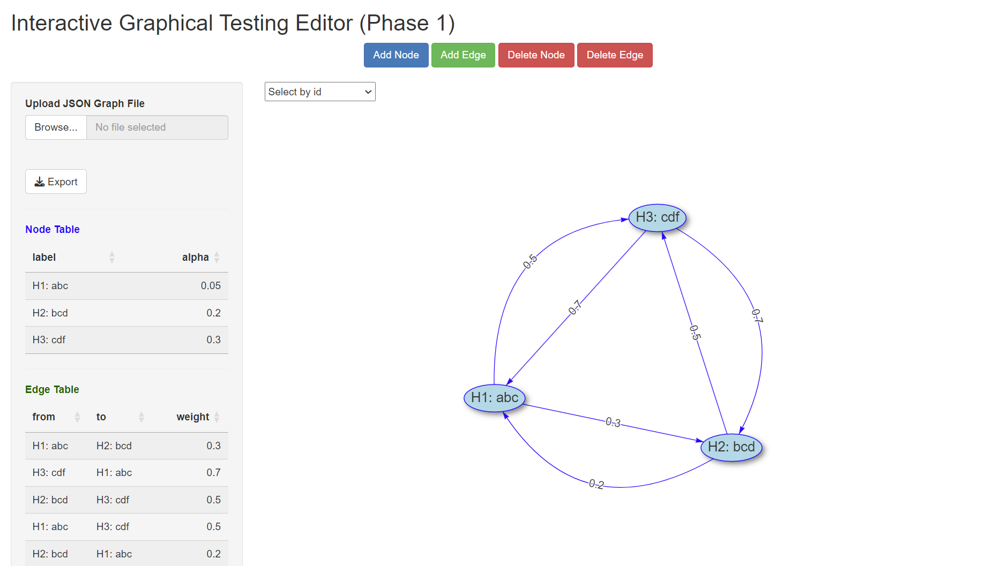
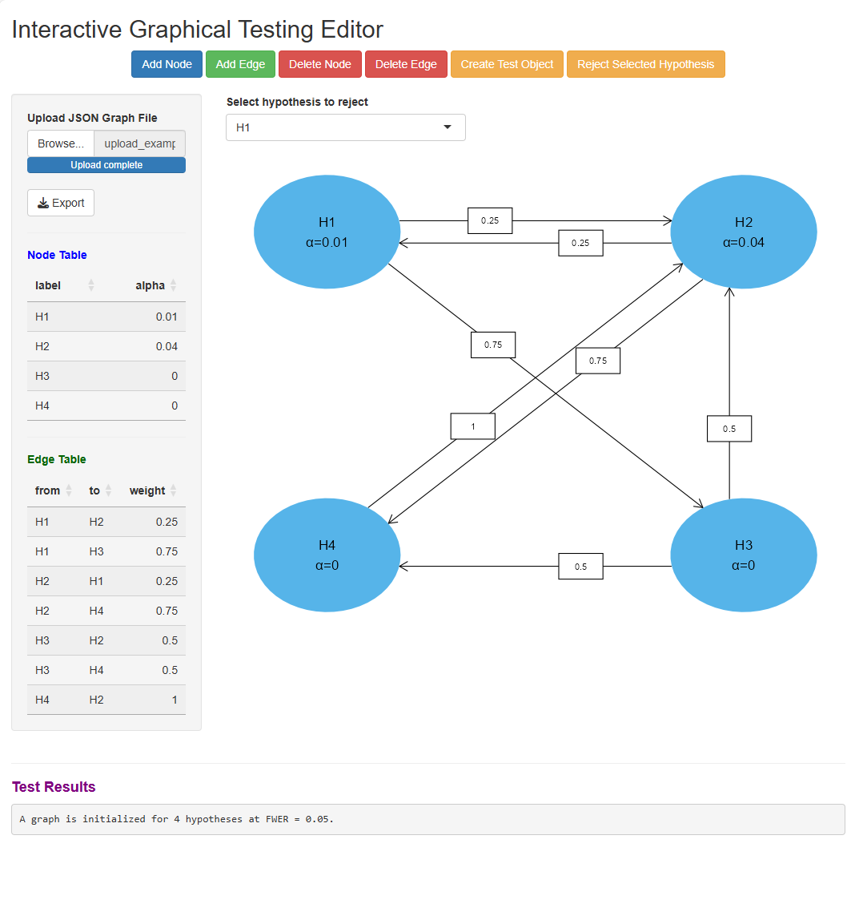

# TrialSimulatorShiny_Interface

An interactive R Shiny interface for the [`TrialSimulator`](https://github.com/zhangh12/TrialSimulator) package, enabling graphical multiple testing design, visualization, and hypothesis evaluation in clinical trial settings.

---

## 📚 Table of Contents

- [Project Overview](#project-overview)
- [Step 1: Graphical Interface Setup](#step-1-graphical-interface-setup)
- [Step 2: Statistical Testing Integration](#step-2-statistical-testing-integration-phase-2)
- [Example JSON File](#example-json-file)
- [How to Launch the App](#how-to-launch-the-app)

---

## 📍 Project Overview

This project aims to create a visual and modular interface for constructing and evaluating graphical multiple testing procedures. It is designed to support hypothesis testing workflows in complex trial designs through both interactive visualization and statistical simulation.

---

## 🔧 Step 1: Graphical Interface Setup

This Shiny app provides an interactive UI for visually defining a multiple testing procedure as a graph.

### Features

- **Add / Delete Nodes**  
  Represent hypotheses as nodes. Each node has an editable `alpha` level.

- **Add / Delete Edges**  
  Represent weight transfers between hypotheses.

- **Edit Edge Weights**  
  Double-click on edges to modify their weights directly.

- **Export / Upload JSON**  
  - Save the current node-edge structure as a `.json` file  
  - Reload previous work by uploading a `.json` graph

### Interface Preview



---

## 🧪 Step 2: Statistical Testing Integration (Phase 2)

In **Phase 2**, the interface is connected to Dr. Zhang’s [`TrialSimulator`](https://github.com/zhangh12/TrialSimulator) R package to enable dynamic testing logic for graphical multiple testing procedures.

### Features

- **Create Test Object**  
  After developing your graph (nodes with `alpha` values and weighted edges), click **"Create Test Object"**. This freezes the graph structure and initializes the test object using the `TrialSimulator` backend.

- **Reject Hypotheses**  
  Select any hypothesis from the dropdown and click **"Reject Selected Hypothesis"** to remove it. The app redistributes weights according to the defined graph logic.

- **Iterative Rejection**  
  You can reject hypotheses multiple times, observing the redistribution of alpha levels and weights until no further rejections can occur.

- **Live Test Results**  
  The app displays the current test results, including the number of hypotheses and the FWER level, at the bottom of the UI.

---

## 📁 Example JSON File

To test the upload functionality, a sample `.json` file is included in the `code/` directory: code/upload_example.json


Use this to instantly load a pre-configured graph and explore the full testing workflow.


---

## 🚀 How to Launch the App

Make sure the following packages are installed:

```r
install.packages(c("shiny", "DT", "visNetwork", "jsonlite"))
devtools::install_github("zhangh12/TrialSimulator")
shiny::runApp("path_to_app_directory")


